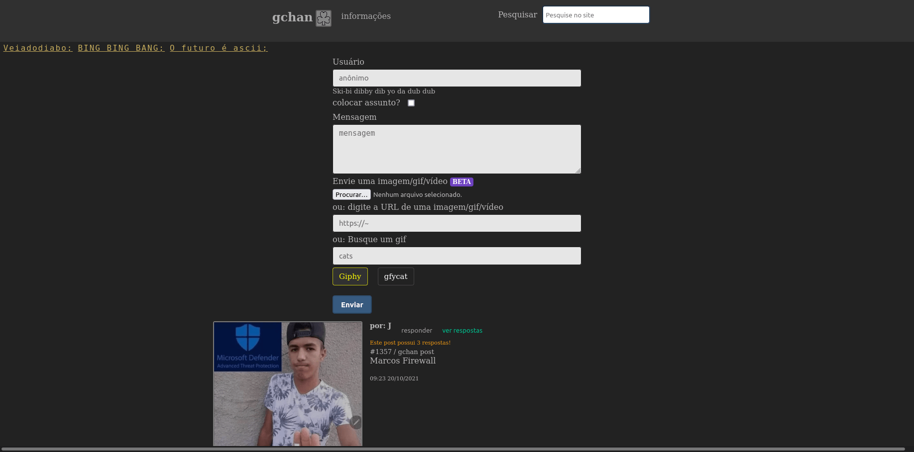

# Repositório oficial do gchan!

Projeto com front-end em vuejs / backend em node.

Contribuições são bem-vindas.

## Instalação no local

Clone o projeto e instale através do package.json

    git clone git@github.com:guites/g.git && cd g && npm i

Altere as URLs do ambiente de produção pro ambiente dev:

    while read -r line; do sed -i 's{https://gchan-message-board.herokuapp.com{http://localhost:5000{' $line; done < <(grep -rl 'https://gchan-message-board.herokuapp.com' src/);
    while read -r line; do sed -i 's{https://gchan.com.br{http://localhost:8080{' $line; done < <(grep -rl 'https://gchan.com.br' src/);

Depois, 

    npm run dev

Antes de dar push no master, leia as instruções em client-deploy.sh

### Prints

Projeto em 10/2021

